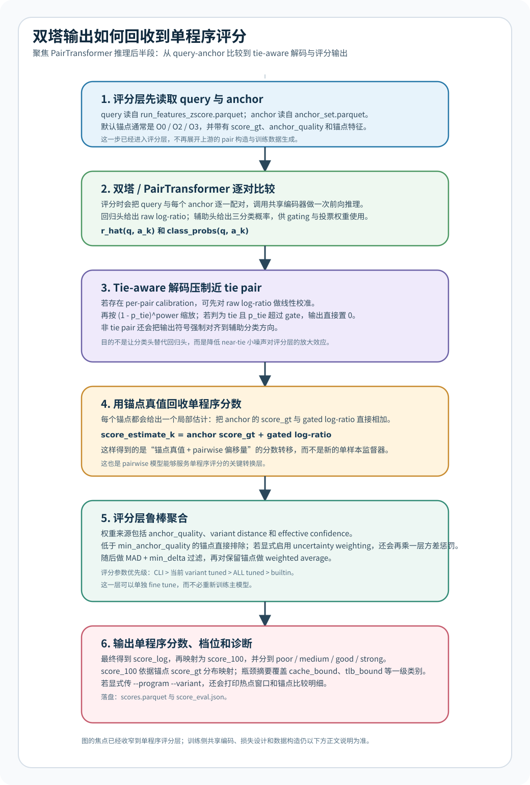

# 双塔架构说明

> 文档定位：这条链路对应“基于已提取访存指标做扩展分析/单程序评分”的后续能力，不是论文题目“基于 eBPF 的细粒度进程访存性能指标提取与分析方法研究”的主叙事入口。若按题目主线阅读，建议先看 [docs/design.md](./design.md) 和 [docs/single-program-analysis-architecture.md](./single-program-analysis-architecture.md)，再回到本文档。

上图现在刻意聚焦“双塔输出如何进入单程序评分”这一段；训练侧的 pairwise 样本构造、共享编码和损失设计仍以下文第 3 到第 4 节为准。

## 1. 架构定位

这条链路负责把大量单次运行摘要，转换成“程序内变体两两比较”的监督信号，再把成对比较结果还原成单程序分数。

这里说的“双塔”，更准确地说是“共享参数的双分支 pairwise 编码器”：

1. 训练输入不是单个程序，而是同一 `program` 下的两个变体摘要 `x_i` 和 `x_j`。
2. 两个分支共享输入投影和编码逻辑，保留 Siamese/双塔接口。
3. 当前实现不是完全隔离的两座塔，而是在共享投影后，把两个摘要作为双 token 一起送进 `TransformerEncoder`。
4. 推理阶段不直接回归单程序绝对分数，而是通过锚点法把 pairwise 预测重新投影到单程序评分空间。

核心目标有两个：

$$
y_{i,j} = \log \frac{C^{iter}_j}{C^{iter}_i}
$$

其中 $C^{iter}$ 是 `cycles_per_iter`，用于表达固定工作量下每次迭代的大致代价。

## 2. 模块分层

| 层级 | 主要文件 | 输入 | 输出 | 作用 |
| --- | --- | --- | --- | --- |
| 运行级摘要层 | [scripts/build_run_features.py](../scripts/build_run_features.py) | `manifest_curated_*` + `window_metrics.jsonl` | `run_features.parquet`、`run_features_zscore.parquet` | 把一次 run 的窗口级指标聚合成统一特征向量 |
| 成对样本层 | [scripts/build_pair_table.py](../scripts/build_pair_table.py) | `run_features*.parquet` | `pairs.parquet` | 枚举同程序 variant pair，生成正反向样本和 log-ratio 标签 |
| 模型训练层 | [scripts/train_transformer.py](../scripts/train_transformer.py) | `pairs.parquet` | `model_transformer.pt`、`model_transformer_eval.json` | 训练共享编码器的 pairwise 模型 |
| 锚点基座层 | [scripts/build_anchor_set.py](../scripts/build_anchor_set.py) | `run_features*.parquet` | `anchor_set.parquet` | 为单程序评分准备 `O0/O2/O3` 锚点和 `score_gt` |
| 单程序评分层 | [scripts/score_program.py](../scripts/score_program.py) | 模型、锚点、query 特征 | `scores.parquet`、`score_eval.json` | 把 pairwise 预测转成单程序分数、档位和诊断 |
| 评分层调优 | [scripts/tune_score_program_fine.py](../scripts/tune_score_program_fine.py) | 模型、锚点、query-anchor 预测缓存 | `score_tune_fine_variant_best.json` | 微调 tie gate、投票权重、离群过滤等评分层参数 |
| 归因分析层 | [analysis/hotspot.py](../analysis/hotspot.py)、[analysis/attribution.py](../analysis/attribution.py)、[analysis/attribution_report.py](../analysis/attribution_report.py) | `window_metrics.jsonl`、`events.jsonl`、评分诊断 | 热点窗口、PID/TID 归因、函数热点、数据集报告 | 把程序级分数进一步落到时间窗、进程实体和函数证据 |

## 3. 数据是怎么进入双塔的

### 3.1 先把原始 run 变成统一摘要

[scripts/build_run_features.py](../scripts/build_run_features.py) 负责把 `window_metrics.jsonl` 聚合成运行级摘要。当前主输入是统一定义在 [scripts/feature_columns.py](../scripts/feature_columns.py) 的 non-time 特征列，来源包括：

1. `ipc`、`cpi` 等效率指标。
2. LLC、dTLB、iTLB miss rate 与 MPKI。
3. fault 强度、fault subtype、mm syscall 密度。
4. 窗口分布统计，例如 mean、std、p95、peak share。
5. warmup / steady-state 阶段特征。

这一步同时输出原始尺度和 z-score 尺度。训练和推理主要消费 `run_features_zscore.parquet`，标签侧仍参考 `run_features.parquet` 里的 `cycles_per_iter`。

### 3.2 再把单样本变成成对样本

[scripts/build_pair_table.py](../scripts/build_pair_table.py) 在同一 `program` 内枚举变体组合，把每一对样本扩成：

1. `x_i`
2. `x_j`
3. `x_i - x_j`
4. 连续标签 `log_ratio`
5. 三分类标签 `i_better / tie / j_better`

这一步默认同时加入正向对和反向对，所以模型看到的是对称数据分布，而不是只学一个固定方向。

## 4. 双塔内部结构

当前主模型是 [scripts/train_transformer.py](../scripts/train_transformer.py) 中的 `PairTransformer`。它保留了双塔接口，但把双分支压缩成一个更紧的共享编码结构：

$$
(x_i, x_j)
\rightarrow \text{shared projection}
\rightarrow \text{2-token TransformerEncoder}
\rightarrow [o_i; o_j; o_i-o_j]
\rightarrow (\hat r_{i,j}, \hat c_{i,j})
$$

其中：

1. `shared projection` 把两个运行级向量映射到同一个隐藏空间。
2. `token_type_emb` 区分第一个 token 和第二个 token。
3. `TransformerEncoder` 允许两个 token 直接交互，而不是完全独立编码后再拼接。
4. 回归头输出连续 `log_ratio`。
5. 辅助分类头输出三分类 logits，用于 `i_better / tie / j_better`。

当前训练策略不是纯回归：

1. 主目标仍是连续倍率回归，方便后续锚点评分。
2. 辅助头用交叉熵专门约束方向边界和 tie 边界。
3. `tie` 和 `near_tie` 样本在回归损失里会降权，避免模型被接近零的小噪声主导。

## 5. 为什么成对模型还能给单程序打分

这部分是整个架构最关键的转换层。

[scripts/build_anchor_set.py](../scripts/build_anchor_set.py) 先为每个 `program` 构建锚点集合，默认使用 `O0 / O2 / O3`，并写出锚点真值：

$$
S_k = \log \frac{C^{iter}_{O0}}{C^{iter}_k}
$$

然后 [scripts/score_program.py](../scripts/score_program.py) 在推理时，把 query 程序与每个锚点逐一配对，得到：

$$
\hat r_{x,k} \approx \log \frac{C^{iter}_k}{C^{iter}_x}
$$

所以每个锚点都能给出一个单程序分数估计：

$$
\hat S_x^{(k)} = S_k + \hat r_{x,k}
$$

再经过多锚点聚合，得到最终单程序分数。

## 6. 评分层不是简单求平均

当前 [scripts/score_program.py](../scripts/score_program.py) 已经把评分层拆成独立的工程模块，而不是“模型输出之后直接平均”。主要包含：

1. tie-aware 解码：高 `p_tie` 的 pair 会被压缩到接近 0，避免把近 tie pair 强行解释成强方向差异。
2. 辅助分类 gating：分类头既决定方向，也参与投票置信度计算。
3. variant 距离权重：query 与 anchor 越近，默认权重越高。
4. `anchor_quality` 权重：低活跃度、低活跃窗口占比的锚点会被下调。
5. 离群过滤：对多个锚点给出的原始估计做中位数/MAD 过滤。
6. 可选 pair calibration：允许按 variant pair 做线性校准。
7. 可选 uncertainty weighting：用 MC dropout 估计 pair 方差，进一步调低不稳定预测的权重。

评分完成后，还会继续生成：

1. 0 到 100 的百分位分数。
2. `poor / medium / good / strong` 档位。
3. 一级瓶颈归因，例如 `cache_bound`、`tlb_bound`、`fault_heavy`、`low_ipc`。
4. 热点窗口摘要和锚点诊断信息。

## 7. 归因分析怎么接到评分结果上

双塔和评分层回答的是“这个变体相对基线优化了多少、主要像哪类瓶颈”；归因分析层回答的是“这些压力具体出现在什么时候、哪个实体上、落到哪个函数”。两者是前后串联关系，不是两个彼此替代的模型。

可以把解释链路拆成三层：

1. [scripts/score_program.py](../scripts/score_program.py) 基于运行级摘要输出 `score_log`、`score_100`、档位，以及 `top_bottleneck` / `second_bottleneck` 这类程序级归因标签。
2. [analysis/hotspot.py](../analysis/hotspot.py) 继续读取同一次 run 的 `window_metrics.jsonl`，把程序级瓶颈落到时间窗，并在热点窗口内给出 PID/TID/comm 级归因。
3. 如果采集时保留了 `events.jsonl`，则 [analysis/attribution.py](../analysis/attribution.py) 再把热点实体对应的 IP 地址符号化到函数级，输出 `function_hotspot.jsonl` 和 CSV。

因此，当前架构中的“归因”并不只是一列 `top_bottleneck`：

1. `score_program.py` 给出的是低成本、全局性的一级瓶颈判断，适合排序、筛选和批量诊断。
2. `hotspot.py` 给出的是时间窗和实体级证据，适合回答“抖动发生在哪个阶段、哪个进程最热”。
3. `attribution.py` 给出的是函数级证据，适合回答“具体热在什么函数、哪段代码”。

这也是为什么训练输入仍然只用运行级摘要，而不直接把函数名或源码位置喂给双塔：模型负责学“访存画像和优化收益”的关系，具体代码定位则交给离线归因层完成。

### 7.1 程序级分数与窗口/函数证据的边界

这条边界最好明确区分：

1. 双塔看到的是聚合后的 run-level 特征，所以它天然擅长做排序、档位和粗粒度瓶颈分类。
2. 热点与函数归因依赖的是原始时间窗和逐事件记录，所以它们擅长做定位和证据回放。
3. 两者共享同一份采集协议：`window_metrics.jsonl` 既支持训练特征构造，也支持热点检测；`events.jsonl` 则在需要更细粒度解释时补充代码级证据。

换句话说，双塔负责“先判断值不值得看”，归因层负责“告诉你应该看哪里”。

### 7.2 典型使用顺序

如果要把模型输出真正变成可操作的诊断，当前更合理的顺序是：

1. 先跑 [scripts/score_program.py](../scripts/score_program.py)，筛出低分样本、异常样本或某类 `top_bottleneck` 明显偏高的样本。
2. 再对目标 run 跑 [analysis/hotspot.py](../analysis/hotspot.py)，看热点窗口、热点实体和时间序列是否与程序级瓶颈一致。
3. 对需要继续追根定位的 run，开启 `events.jsonl` 后走 [analysis/attribution.py](../analysis/attribution.py) 做函数级归因。
4. 如果是批量实验复盘，则直接汇总到 [analysis/attribution_report.py](../analysis/attribution_report.py) 和 [analysis/dataset_hotspot_report.py](../analysis/dataset_hotspot_report.py)。

更完整的单程序分析细节，可参考 [docs/single-program-analysis-architecture.md](../docs/single-program-analysis-architecture.md)。

## 8. 这条架构为什么这样设计

### 8.1 不直接做单程序绝对回归

直接回归“这个程序到底值多少分”很容易把问题变成跨程序归一化，而当前数据更稳定的监督信号其实是同一程序内部的变体差异。pairwise 训练先解决“谁更优、差多少”，再通过锚点法解决参考系问题，工程上更稳。

### 8.2 不把程序名和变体名作为模型输入

当前主线故意避免把 `program`、`variant` 或 rank 直接喂给模型，原因是这些字段太容易泄漏先验，模型会学到“谁通常更快”，而不是学到访存画像与优化效果之间的关系。

### 8.3 把训练层和评分层解耦

`PairTransformer` 负责学 pairwise 表达，`score_program.py` 负责把预测投影到单程序分数。这样做的好处是：

1. 可以只微调评分层，不必每次都重训主模型。
2. `score-first`、`time-first`、`time-aware` 可以作为独立评分口径切换。
3. 后续如果更换 backbone，只要输出仍是 pairwise `log_ratio`，大部分评分层都能复用。

## 9. 阅读和改动这条链路时，应该先看哪里

如果是要理解或修改这条架构，建议按下面顺序读代码：

1. 先看 [scripts/build_pair_table.py](../scripts/build_pair_table.py)，确认标签和样本构造。
2. 再看 [scripts/train_transformer.py](../scripts/train_transformer.py)，确认双塔/双 token 编码、损失和评估。
3. 接着看 [scripts/build_anchor_set.py](../scripts/build_anchor_set.py)，确认锚点真值定义。
4. 最后看 [scripts/score_program.py](../scripts/score_program.py) 和 [scripts/tune_score_program_fine.py](../scripts/tune_score_program_fine.py)，理解单程序评分和评分层调优。

如果只是查当前产物，优先看：

1. `train_set/pairs_stats.json`
2. `train_set/model_transformer_eval.json`
3. `train_set/anchor_set.stats.json`
4. `train_set/score_eval.json`