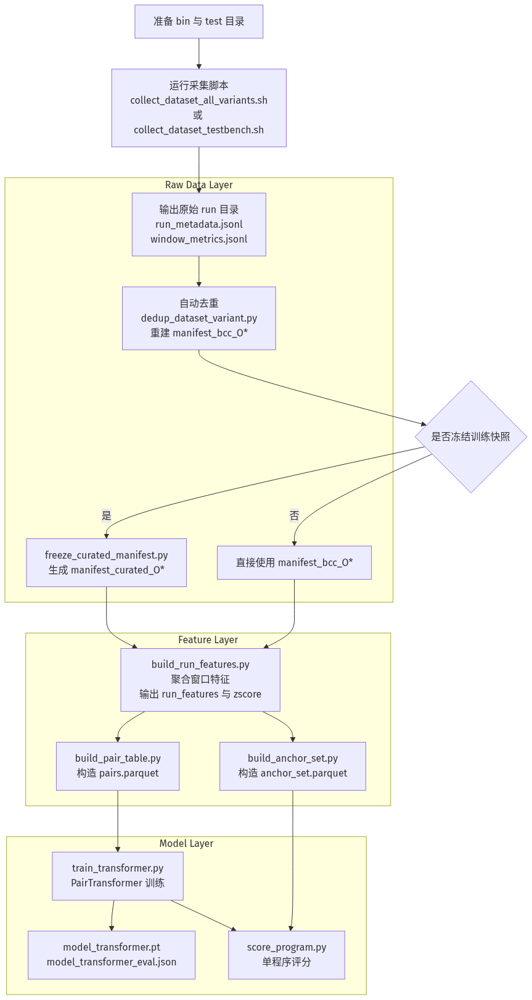

# 从数据采集到 Transformer Encoder 的具体流程

> 这份文档给出一条可直接执行的主线：从 llvm-test-suite 的 BCC 采集开始，一直到 PairTransformer 训练与产物落盘为止。

## 1. 总览



Mermaid 源文件在 [assets/collection-to-transformer-workflow.mmd](assets/collection-to-transformer-workflow.mmd)。

这条主线对应当前仓库里已经存在的真实脚本，而不是额外假设的一套新系统：

1. 采集阶段生成每个 variant 的原始 run 目录与 manifest。
2. 采集脚本自动按样本质量去重，避免同一程序重复 run 混入训练输入。
3. 如需冻结一版可复现训练快照，再把 raw manifest 收束成 curated manifest。
4. 从窗口级 JSONL 聚合出运行级摘要特征。
5. 在程序内构造 O0/O1/O2/O3 pair，并生成锚点集。
6. 用 PairTransformer 把两个运行摘要编码成双 token 序列，训练成对回归模型。
7. 训练完成后，再结合锚点集做单程序评分。

## 2. 入口与产物对应关系

| 阶段 | 主脚本 | 主要输入 | 主要输出 |
| --- | --- | --- | --- |
| 采集 | [experiments/llvm_test_suite/collect_dataset_all_variants.sh](../../experiments/llvm_test_suite/collect_dataset_all_variants.sh) / [experiments/llvm_test_suite/collect_dataset_testbench.sh](../../experiments/llvm_test_suite/collect_dataset_testbench.sh) | `bin/O*`、`test/O*`、eBPF/BCC 环境 | `data/llvm_test_suite/bcc/O*/<program>_<timestamp>/`、`manifest_bcc_O*.jsonl` |
| 自动去重 | [experiments/llvm_test_suite/dedup_dataset_variant.py](../../experiments/llvm_test_suite/dedup_dataset_variant.py) | 某个 variant 的 `bcc/O*` 与 `manifest_bcc_O*.jsonl` | 删除较差重复样本，重建单 variant manifest |
| 冻结快照 | [scripts/freeze_curated_manifest.py](../../scripts/freeze_curated_manifest.py) | `manifest_bcc_O*.jsonl` | `manifest_curated_O*.jsonl`、`manifest_curated_summary.json` |
| 运行级特征 | [scripts/build_run_features.py](../../scripts/build_run_features.py) | `manifest_*_O*.jsonl`、`window_metrics.jsonl`、`run_metadata.jsonl` | `train_set/run_features.parquet`、`run_features_zscore.parquet`、`feature_scaler.json` |
| pair 构建 | [scripts/build_pair_table.py](../../scripts/build_pair_table.py) | `run_features.parquet`、`run_features_zscore.parquet` | `train_set/pairs.parquet` |
| 锚点构建 | [scripts/build_anchor_set.py](../../scripts/build_anchor_set.py) | `run_features.parquet`、`run_features_zscore.parquet` | `train_set/anchor_set.parquet` |
| Transformer 训练 | [scripts/train_transformer.py](../../scripts/train_transformer.py) | `train_set/pairs.parquet` | `train_set/model_transformer.pt`、`model_transformer_eval.json` |

## 3. 端到端执行顺序

### Step 0. 准备环境与输入目录

采集链路默认依赖下面这些目录已经存在：

1. `data/llvm_test_suite/bin/O0~O3/`：预编译 benchmark 可执行文件。
2. `data/llvm_test_suite/test/O0~O3/`：每个 benchmark 的 `.test` 运行规格。
3. `src/loader.py`、BCC/eBPF 所需内核能力与 root 权限。

如果只验证训练链路而不重新采集，可以直接从 Step 3 开始。

### Step 1. 采集原始 BCC run

推荐入口是按 variant 顺序批量采集：

```bash
sudo bash experiments/llvm_test_suite/collect_dataset_all_variants.sh -v "O0 O1 O2 O3"
```

如果只跑一个 variant，可直接调用：

```bash
sudo VARIANT=O0 bash experiments/llvm_test_suite/collect_dataset_testbench.sh
```

采集结束后，每个程序会得到一个 run 目录，典型结构如下：

```text
data/llvm_test_suite/bcc/O0/<program>_<timestamp>/
├── run_metadata.jsonl
└── window_metrics.jsonl
```

同时脚本会写出单 variant manifest：

```text
data/llvm_test_suite/manifest_bcc_O0.jsonl
```

这里的每一行都描述一次 run，包括 `program`、`variant`、`output_dir`、`completion_count` 等字段。

### Step 2. 自动去重与 manifest 收敛

当前采集脚本默认已经把去重接在收尾处：

1. [experiments/llvm_test_suite/collect_dataset_testbench.sh](../../experiments/llvm_test_suite/collect_dataset_testbench.sh) 会在单 variant 采集完成后自动调用 [experiments/llvm_test_suite/dedup_dataset_variant.py](../../experiments/llvm_test_suite/dedup_dataset_variant.py)。
2. 去重规则不是“保留最新”，而是优先保留更完整、更密集的样本：
   - `valid`：目录同时存在 `run_metadata.jsonl` 与 `window_metrics.jsonl`
   - `total_samples`：窗口级 `samples` 总量更高
   - `window_lines`：窗口条目更多
   - `completion_count`：完成轮次更高
3. 去重完成后会重写 `manifest_bcc_<VARIANT>.jsonl`，使 manifest 和磁盘目录一致。

如果你想只检查不实际删除，可以单独干跑：

```bash
.venv/bin/python experiments/llvm_test_suite/dedup_dataset_variant.py \
  --variant O0 \
  --project-root /home/ssy/mem-profiler \
  --output-root /home/ssy/mem-profiler/data/llvm_test_suite/bcc/O0 \
  --manifest /home/ssy/mem-profiler/data/llvm_test_suite/manifest_bcc_O0.jsonl \
  --bin-dir /home/ssy/mem-profiler/data/llvm_test_suite/bin/O0 \
  --test-dir /home/ssy/mem-profiler/data/llvm_test_suite/test/O0 \
  --window-sec 1.0 \
  --duration-sec 60 \
  --sample-rate 100 \
  --dry-run
```

### Step 3. 冻结训练快照（推荐）

如果目标是训练一版可复现模型，而不是直接消费最新 raw run，建议先冻结 curated manifest：

```bash
.venv/bin/python scripts/freeze_curated_manifest.py \
  --data-root data/llvm_test_suite \
  --input-prefix manifest_bcc \
  --output-prefix manifest_curated
```

这一层的作用是：

1. 按 variant 读取 `manifest_bcc_O*.jsonl`。
2. 对每个 program 只保留一条完整 run。
3. 要求四个 variant 的 program 集合完全一致。

如果你就是要基于当前 raw manifest 直接重建训练集，也可以跳过这一步，后续继续使用默认的 `manifest_bcc` 前缀。

### Step 4. 从窗口级 JSONL 聚合运行级特征

训练阶段真正消费的不是窗口序列本身，而是运行级摘要特征。生成命令如下：

```bash
.venv/bin/python scripts/build_run_features.py \
  --data-root data/llvm_test_suite \
  --manifest-prefix manifest_curated \
  --output train_set
```

这个脚本会完成四件事：

1. 读取 `manifest_curated_O0~O3.jsonl`。
2. 对每个 run 的 `window_metrics.jsonl` 做窗口聚合。
3. 默认过滤语义无效 run：`active_pid_count < 5` 或 `cycles_per_iter <= 0` 的样本不会进入下游训练表。
4. 生成运行级原始特征表 `run_features.parquet`。
5. 生成训练输入使用的 z-score 特征表 `run_features_zscore.parquet`。

过滤摘要会额外写到：

```text
train_set/run_feature_filter_summary.json
```

当前进入模型的主特征包括：

1. IPC/CPI
2. LLC miss / dTLB miss / iTLB miss 类 MPKI 与 miss rate
3. fault 与 mm syscall 密度
4. 窗口分布统计（mean/std/p95/peak_share/min）
5. warmup / steady-state 阶段比值特征

### Step 5. 构造 pair 表

Transformer 训练不是直接吃单样本，而是先在同一程序内构造 variant pair：

```bash
.venv/bin/python scripts/build_pair_table.py
```

这里会基于同一个 program 的 O0/O1/O2/O3 组合，构造：

1. `(variant_i, variant_j)` 的正向 pair
2. `(variant_j, variant_i)` 的反向 pair
3. 标签 `log_ratio = log(cycles_per_iter_j / cycles_per_iter_i)`

之所以不是直接用 `total_cycles`，是因为采集脚本按固定时长 while-true 重复运行基准，快版本会完成更多迭代，因此必须回到 `cycles_per_iter` 这个固定工作量代理。

输出文件是：

```text
train_set/pairs.parquet
```

### Step 6. 构造锚点集（为后续单程序评分做准备）

这一步不是在做评分，而是在提前准备评分时要用到的锚点真值和锚点特征：

```bash
.venv/bin/python scripts/build_anchor_set.py
```

当前默认锚点是：

1. `O0`：baseline
2. `O3`：reference

输出文件是：

```text
train_set/anchor_set.parquet
```

`anchor_set.parquet` 可以在训练前就构造好，因为它只依赖运行级特征，不依赖 Transformer 权重。

### Step 7. 训练 PairTransformer

有了 `pairs.parquet` 之后，就可以启动 Transformer Encoder 训练：

```bash
.venv/bin/python scripts/train_transformer.py --device cpu
```

如果要显式指定主要超参，可以这样跑：

```bash
.venv/bin/python scripts/train_transformer.py \
  --pairs train_set/pairs.parquet \
  --d-model 64 \
  --nhead 4 \
  --nlayers 3 \
  --epochs 200 \
  --device cpu
```

训练完成后，核心输出在 `train_set/` 下：

1. `model_transformer.pt`
2. `model_transformer_eval.json`

### Step 8. 用训练好的 PairTransformer 做单程序评分

真正的单程序评分是在模型训练完成之后执行的，因为 [scripts/score_program.py](../../scripts/score_program.py) 同时依赖：

1. `train_set/model_transformer.pt`
2. `train_set/anchor_set.parquet`
3. `train_set/run_features_zscore.parquet`

执行命令如下：

```bash
.venv/bin/python scripts/score_program.py --device cpu
```

如果只看某个程序/变体的评分与诊断输出，可以这样跑：

```bash
.venv/bin/python scripts/score_program.py \
  --device cpu \
  --program aha \
  --variant O2
```

这一步的逻辑不是“直接回归单程序分数”，而是：

1. 取 query run 的 z-score 特征。
2. 取同一 program 的 anchor runs（通常是 O0、O3）。
3. 用训练好的 PairTransformer 预测 `model(query, anchor)`。
4. 把预测的 pairwise log-ratio 加到锚点真值 `score_gt` 上，得到单程序分数估计。

## 4. Transformer Encoder 在这条链路里的位置

### 4.1 输入张量是怎么来的

PairTransformer 不是直接读取 JSONL，而是读取 `pairs.parquet` 中每条 pair 的运行级 z-score 特征：

$$
(x_i, x_j),\quad x_i, x_j \in \mathbb{R}^{54}
$$

其中：

1. `x_i` 对应 `variant_i` 的运行级摘要特征。
2. `x_j` 对应 `variant_j` 的运行级摘要特征。
3. 标签是 `log(cycles_per_iter_j / cycles_per_iter_i)`。

### 4.2 编码结构

当前实现对应的是一个双 token 的 PairTransformer：

$$
[x_i, x_j]
\rightarrow \text{shared projection}
\rightarrow \text{token type embedding}
\rightarrow \text{TransformerEncoder}
\rightarrow [o_i; o_j; o_i - o_j]
\rightarrow \text{regression head}
\rightarrow \hat{y}_{i,j}
$$

这和传统的长序列 Transformer 不同，关键点只有两个：

1. 每个 run 摘要是一个 token，而不是一个窗口序列。
2. Transformer 的任务是学习两个 token 之间的方向性比较关系，而不是做自回归建模。

### 4.3 为什么这条路线成立

当前仓库里这条路线成立的原因有三个：

1. 窗口级时序还没被证明比运行级摘要更关键。
2. pairwise 任务本身就是“谁更优、差多少”，很适合共享编码器 + 显式差分。
3. 当前样本量更适合双 token 比较器，而不是更复杂的长时序 backbone。

## 5. 推荐的最小可复现实验命令集

如果你要从“重新采 raw data”一路跑到“重新训练 PairTransformer”，推荐最小命令序列如下：

```bash
# 1) 采集并自动去重
sudo bash experiments/llvm_test_suite/collect_dataset_all_variants.sh -v "O0 O1 O2 O3"

# 2) 冻结可复现训练快照
.venv/bin/python scripts/freeze_curated_manifest.py \
  --data-root data/llvm_test_suite \
  --input-prefix manifest_bcc \
  --output-prefix manifest_curated

# 3) 构建运行级特征
.venv/bin/python scripts/build_run_features.py \
  --data-root data/llvm_test_suite \
  --manifest-prefix manifest_curated \
  --output train_set

# 4) 构建 pair 和 anchor
.venv/bin/python scripts/build_pair_table.py
.venv/bin/python scripts/build_anchor_set.py

# 5) 训练 PairTransformer
.venv/bin/python scripts/train_transformer.py --device cpu

# 6) 用训练后的模型做单程序评分
.venv/bin/python scripts/score_program.py --device cpu
```

## 6. 如何重新生成流程图 PNG

Mermaid 源文件是 [assets/collection-to-transformer-workflow.mmd](assets/collection-to-transformer-workflow.mmd)。

当前仓库里没有固定的本地 Mermaid CLI，因此这里采用静态远端渲染方式把 `.mmd` 生成 `.png`：

```bash
.venv/bin/python - <<'PY'
import base64
import pathlib
import urllib.request
import zlib

root = pathlib.Path('docs/new-repo-plan/assets')
src = (root / 'collection-to-transformer-workflow.mmd').read_text()
payload = base64.urlsafe_b64encode(zlib.compress(src.encode('utf-8'))).decode('ascii')
url = 'https://kroki.io/mermaid/png/' + payload
req = urllib.request.Request(url, headers={'User-Agent': 'Mozilla/5.0'})
with urllib.request.urlopen(req, timeout=30) as resp:
    (root / 'collection-to-transformer-workflow.png').write_bytes(resp.read())
PY
```

重新生成后，这份 Markdown 会自动显示最新 PNG。