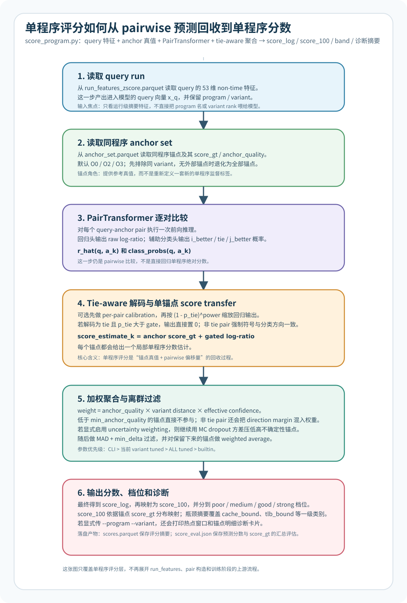

# 单程序评分流程

> 这份文档只展开 [scripts/score_program.py](../../scripts/score_program.py) 这一层，说明训练好的 PairTransformer 如何把 pairwise 预测回收到单程序分数、档位和诊断输出。完整链路见 [06-collection-to-transformer-workflow.md](06-collection-to-transformer-workflow.md)。



## 1. 这一步在回答什么问题

单程序评分的目标不是重新训练一个“单样本回归器”，而是基于已经训练好的 pairwise 模型，把某个 query run 的相对比较结果折算成绝对分数：

$$
S_q = \log\left(\frac{T_{O0}}{T_q}\right)
$$

这里的 $T_q$ 表示 query run 的固定工作量时间代理，$T_{O0}$ 表示同一 program 的 O0 基线时间代理。`score_program.py` 并不直接看到这个真值，而是借助同一 program 的锚点样本来间接恢复它。

对任意一个锚点 $a_k$，脚本先用 PairTransformer 预测 query 和 anchor 的 pairwise log-ratio：

$$
\hat r_{q,k} = \operatorname{model}(q, a_k)
$$

再把它加回锚点真值 `score_gt`：

$$
\hat S_q^{(k)} = S_{a_k} + \hat r_{q,k}
$$

最后再对多个锚点给出的估计做过滤和加权聚合，得到最终的单程序分数 $\hat S_q$。

## 2. 输入与输出

| 类型 | 路径 | 作用 |
| --- | --- | --- |
| 必需输入 | `train_set/model_transformer.pt` | 已训练好的 PairTransformer 权重 |
| 必需输入 | `train_set/anchor_set.parquet` | 锚点样本表，提供 `score_gt`、`anchor_quality` 和锚点特征 |
| 必需输入 | `train_set/run_features_zscore.parquet` | 待评分 query runs 的 z-score 特征 |
| 可选输入 | `train_set/score_tune_fine_variant_best.json` | 按 query variant 覆盖默认评分参数 |
| 可选输入 | `train_set/pair_calibration.json` | per-pair 线性校准器；只有显式传 `--pair-calibration-blend > 0` 才真正生效 |
| 主输出 | `train_set/scores.parquet` | 每个 run 的 `score_log`、`score_100`、`band`、瓶颈摘要和参数解析信息 |
| 主输出 | `train_set/score_eval.json` | 预测分数与 `score_gt` 的聚合评估 |
| 终端输出 | `--program --variant` | 打印单个 query 的锚点明细、瓶颈归因和热点窗口证据 |

当前默认锚点通常是 O0、O2、O3，但真正使用哪些 anchor，不是写死在评分脚本里，而是由 [scripts/build_anchor_set.py](../../scripts/build_anchor_set.py) 生成的 `anchor_set.parquet` 决定。

## 3. 评分主流程

### 3.1 先取 query 和同程序锚点

脚本会从 `run_features_zscore.parquet` 中逐条读取 query run，再从 `anchor_set.parquet` 中取同一 `program` 的锚点。默认会尽量排除与 query 相同 `variant` 的锚点；如果该程序没有任何外部锚点，才退化为使用这个程序已有的全部锚点。

### 3.2 对每个 query-anchor pair 做一次模型推断

对每个锚点，脚本都会调用训练好的 PairTransformer，同时得到两类输出：

1. 回归头给出的 raw `log_ratio`
2. 三分类辅助头给出的 `i_better / tie / j_better` logits

如果显式启用了 `--pair-calibration-blend`，raw `log_ratio` 还会先经过 `pair_calibration.json` 中对应 variant pair 的线性校准。

### 3.3 用 tie-aware 解码把近 tie pair 压回中性区

评分脚本不会直接把 raw `log_ratio` 加回锚点真值，而是先经过一层 tie-aware 解码：

$$
\hat r^{\mathrm{gated}}_{q,k} = \hat r^{\mathrm{cal}}_{q,k} \cdot (1 - p_{\mathrm{tie}})^{\gamma}
$$

其中：

1. $p_{\mathrm{tie}}$ 来自辅助分类头的 tie 概率
2. $\gamma$ 对应 `tie_shrink_power`
3. 如果解码类别是 `tie` 且 $p_{\mathrm{tie}} \ge \tau$，脚本会直接把该 pair 的 gated `log_ratio` 置为 0，其中 $\tau$ 对应 `tie_gate_threshold`
4. 如果解码类别是 `i_better` 或 `j_better`，脚本还会强制输出符号与分类方向一致

这一步的目的不是让辅助头替代回归头，而是利用分类头去压制近 tie pair 对最终单程序分数的干扰。

### 3.4 从单个锚点得到一个单程序分数估计

对每个锚点，脚本都会生成一个局部估计：

$$
\hat S_q^{(k)} = S_{a_k} + \hat r^{\mathrm{gated}}_{q,k}
$$

其中 `S_{a_k}` 就是 `anchor_set.parquet` 里的 `score_gt`。这使得单程序评分本质上是“锚点真值 + pairwise 偏移量”的回收过程，而不是重新定义一套新标签。

### 3.5 再按质量、距离和分类置信度做加权聚合

每个锚点估计都有一个投票权重。当前实现里的主权重来源有四类：

1. `anchor_quality`：低质量锚点天然权重更低；低于 `min_anchor_quality` 的锚点直接不参与聚合
2. variant 距离权重：距离越近越高，当前实现是 `max(0.55, 1 - 0.15 * distance)`
3. 分类置信度：非 tie pair 不只看最大类概率，还会按 `tie_margin_weight_alpha` 把 `direction margin` 混入权重，降低近 tie directional pair 的影响
4. 可选 uncertainty 惩罚：只有同时满足 `--uncertainty-samples > 1` 和 `--uncertainty-weight-lambda > 0` 时，才会用 MC dropout 方差继续压低高不确定性锚点

启用 uncertainty-aware weighting 后，额外惩罚项为：

$$
w_k^{\mathrm{uncertainty}} = \frac{1}{1 + \lambda \cdot \operatorname{Var}(\hat r_{q,k}) / \epsilon}
$$

### 3.6 过滤离群锚点，再做最终加权平均

脚本不会盲目把所有锚点估计都平均，而是先对各个 `score_estimate_raw` 做一轮中位数绝对偏差过滤：

1. 以所有锚点估计的中位数为中心
2. 用 `max(anchor_outlier_min_delta, anchor_outlier_mad_scale * MAD)` 作为容忍阈值
3. 把超出阈值的估计视为离群项并排除

最后如果仍有有效权重，就对保留下来的估计做加权平均；否则退化为普通平均。得到的最终结果就是 `score_log`。

### 3.7 把 `score_log` 转成更容易解释的输出

`score_log` 只是对数分数，终端和结果表还会进一步补充三类解释层：

1. `score_100`：按所有锚点 `score_gt` 的经验分布做百分位映射
2. `band`：把 0 到 100 分划成 `poor / medium / good / strong`
3. 瓶颈摘要：按 `cache_bound / tlb_bound / fault_heavy / low_ipc` 四组特征计算 severity，并保留 Top 1/Top 2 类别

如果命令里显式传了 `--program` 和 `--variant`，脚本还会读取该 run 的 `window_metrics.jsonl`，打印热点窗口证据，但这部分目前不会写回 `scores.parquet`。

## 4. 默认参数是怎么决定的

评分脚本支持对 tie gate、投票权重和离群过滤参数做 per-variant 覆盖，但真实优先级不是“谁写在 JSON 里就一定生效”，而是下面这条链：

1. `CLI 显式传参`
2. `当前 query variant 的 tuned best`，前提是这一组 tuned 结果被判定为 reliable
3. `ALL tuned best`
4. `代码硬编码默认值`

当前内置默认值是：

1. `tie_gate_threshold = 0.55`
2. `tie_shrink_power = 1.0`
3. `tie_margin_weight_alpha = 0.30`
4. `min_anchor_quality = 0.30`
5. `anchor_outlier_mad_scale = 3.0`
6. `anchor_outlier_min_delta = 0.35`

如果使用 tuned JSON，`--tuned-selection-objective` 还可以在三套目标之间切换：

1. `score`：优先 proxy 分数一致性，当前默认值
2. `time`：优先 strict 时间外部验证
3. `time-aware`：保留更偏时间一致性的折中口径

某个 variant-local tuned best 只有在满足下面条件时，才会压过 `ALL`：

1. `n_score_valid >= 32`
2. `score_corr` 是有限数
3. `n_time_valid >= 32`
4. `time_corr` 是有限数且非负
5. 它的 `score_corr` 不能明显落后于 `ALL`

这也是为什么当前评分脚本实现了“variant-local tuned 可用，但不可靠时自动回退到 ALL”的行为。

## 5. 最小命令集

默认跑全量评分：

```bash
.venv/bin/python scripts/score_program.py --device cpu
```

只看某个程序和变体的完整诊断卡片：

```bash
.venv/bin/python scripts/score_program.py \
  --device cpu \
  --program aha \
  --variant O2
```

切到更看重时间一致性的 tuned 口径：

```bash
.venv/bin/python scripts/score_program.py \
  --device cpu \
  --tuned-selection-objective time
```

显式打开 uncertainty-aware anchor weighting：

```bash
.venv/bin/python scripts/score_program.py \
  --device cpu \
  --uncertainty-samples 6 \
  --uncertainty-dropout 0.10 \
  --uncertainty-weight-lambda 0.02
```

显式混入 per-pair calibration：

```bash
.venv/bin/python scripts/score_program.py \
  --device cpu \
  --pair-calibration-blend 0.25
```

## 6. `scores.parquet` 里最值得看的字段

这份结果表不是完整诊断转储，而是“便于下游脚本继续消费”的评分摘要。当前最关键的字段包括：

1. `program`、`variant`
2. `score_log`、`score_100`、`band`
3. `n_anchors`、`n_anchors_used`
4. `top_bottleneck`、`top_bottleneck_sev`、`second_bottleneck`
5. `pair_calibration_enabled`、`pair_calibration_blend`
6. `uncertainty_weighting_enabled` 及其统计摘要
7. `scoring_param_resolution`：记录每个评分参数最终来自 CLI、当前 variant、ALL 还是内置默认值
8. `score_gt`：如果该 run 同时也出现在 anchor set 里，则可用于离线评估

如果你的目标是检查评分路径是否工作正常，优先看 [train_set/score_eval.json](../../train_set/score_eval.json)。如果你的目标是看某个程序为什么被打成某个档位，优先跑 `--program --variant` 看终端诊断卡片。