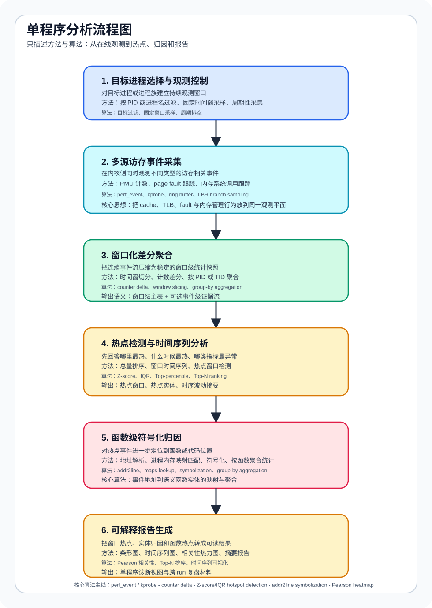

# 单程序分析架构说明

## 1. 架构定位

这条链路解决的是“给一个正在运行或已经采集完成的单个程序，如何把访存行为采下来、聚起来、解释出来”。

它和双塔建模链路的边界很清楚：

1. 单程序分析负责采集、聚合、热点检测、函数级归因和报告生成。
2. 双塔链路负责跨 run 的特征学习、pairwise 比较、单程序锚点构造，以及基于锚点的单程序优化程度推断。
3. 两者通过 `window_metrics.jsonl`、`events.jsonl` 和后续 `run_features.parquet` 相连，但不是同一个执行面。

如果把仓库拆成职责层次，这条单程序分析链路就是从 eBPF 数据面一直到离线诊断报告的完整闭环。

## 2. 在线采集层

### 2.1 入口控制

[src/loader.py](../src/loader.py) 是用户态入口。它负责：

1. 解析 `--pid` 或 `--comm`。
2. 配置窗口长度、采样率、probe 开关、是否按 TID 聚合。
3. 创建 `Collector` 和 `Exporter`。
4. 用固定窗口周期性 `drain_window()`，把每个窗口的快照写盘。

这意味着单程序分析的主调度面很薄：控制逻辑在 `loader.py`，真正的采集和聚合在 `collector.py`。

### 2.2 采集控制

[src/collector.py](../src/collector.py) 是这条链路的核心控制器。它负责：

1. 加载 [src/bcc_prog.c](../src/bcc_prog.c) 或对接 [bpf/mem_events.bpf.c](../bpf/mem_events.bpf.c) 的数据结构。
2. 绑定 perf_event、kprobe、ring buffer 等采集入口。
3. 把 PMU 计数、page fault、mm syscall、LBR 等原始数据拉回用户态。
4. 以窗口为单位做差分和聚合，形成 `WindowSnapshot`。

`WindowSnapshot` 是线上采集和离线分析之间最重要的边界对象。它把一次时间窗内的所有观测整理成：

1. `entries`：按 PID 或 TID 聚合后的窗口记录。
2. `events`：逐事件记录，供更细粒度归因使用。

### 2.3 eBPF 数据面

内核侧并不是一个单探针，而是一组协作的 probe：

1. PMU/perf_event：采集 LLC、dTLB、iTLB、cycles、instructions 等指标。
2. kprobe：采集 minor/major fault。
3. fault 分类增强：细分 `anon/file/shared/private/write/instruction` fault。
4. mm syscall 跟踪：统计 `mmap / munmap / mprotect / brk`。
5. 可选 LBR：保留分支栈证据，为深度分析提供上下文。

共享结构定义主要在 [bpf/mem_events.h](../bpf/mem_events.h) 以及 `src/bcc_*.h` 头文件中，保证内核态和用户态字段对齐。

## 3. 持久化边界

[src/exporter.py](../src/exporter.py) 把在线采集结果落成三类 JSONL 文件：

1. `run_metadata.jsonl`：记录 run 级元信息，例如目标进程、窗口大小、采样率、probe 开关、主机信息。
2. `window_metrics.jsonl`：记录每个窗口、每个 PID/TID 的聚合指标，是后续分析最主要的输入表。
3. `events.jsonl`：可选的逐事件证据流，只有在 `--emit-events` 或 `--lbr` 时才会写出。

这三类文件的作用不同：

1. `run_metadata.jsonl` 是控制平面。
2. `window_metrics.jsonl` 是主分析平面。
3. `events.jsonl` 是深度归因证据平面。

## 4. 离线分析层

### 4.1 热点检测与时间窗分析

[analysis/hotspot.py](../analysis/hotspot.py) 直接读取 `window_metrics.jsonl`，完成三类最常用分析：

1. 按 PID/TID 聚合，找出某个指标的热点实体。
2. 按 `window_id` 汇总，生成时间序列，观察性能压力在时间上的变化。
3. 用 `zscore / iqr / top_pct` 标记热点窗口，再对热点窗口做 PID/TID 归因。

因此它既是“单程序总体热点分析器”，也是“进一步做细粒度归因前的入口筛选器”。

### 4.2 函数级归因

如果采集时开启了 `events.jsonl`，则可以继续走 [analysis/attribution.py](../analysis/attribution.py)：

1. 先过滤目标 PID 和目标事件类型。
2. 提取事件中的 IP 地址。
3. 通过 [analysis/symbolize.py](../analysis/symbolize.py) 结合 `/proc/maps` 和 `addr2line` 做地址符号化。
4. 按函数聚合，输出 `function_hotspot.jsonl` 和 CSV。

这一层回答的是“热点到底落在哪些函数或代码位置”，而不仅是“哪个 PID 最热”。

### 4.3 报告生成

围绕单程序和数据集级分析，当前已经有多层报告脚本：

1. [analysis/report.py](../analysis/report.py)：为单次分析结果生成时间序列、热点条形图、函数级热点图、指标相关性热力图。
2. [analysis/attribution_report.py](../analysis/attribution_report.py)：对默认数据集目录做批量归因汇总，并生成 Markdown 报告。
3. [analysis/dataset_hotspot_report.py](../analysis/dataset_hotspot_report.py)：读取跨 run 热点 CSV，生成数据集级图表。

这使得单程序分析并不止停在控制台输出，而是能稳定地产出论文和报告可复用的材料。

如果要把这些结果进一步整理成“eBPF 输出 vs 外部参考”的可引用对照表，可继续参考 [docs/correctness-validation.md](./correctness-validation.md)。该文档统一说明了 PMU 对 `perf stat`、函数热点对 `perf report`、fault 对 `/proc/<pid>/stat` 或微基准的输入准备与表格生成流程。

如果要整理的是“默认配置是否低开销、稳定，以及参数应该怎么选”的方法学结论，则统一参考 [docs/methodology-validation.md](./methodology-validation.md) 与 [scripts/build_methodology_tables.py](../scripts/build_methodology_tables.py)。

## 5. 这条链路里的关键数据对象

### 5.1 `window_metrics.jsonl`

这是整个单程序分析的主干数据。它已经包含：

1. PMU 计数量。
2. fault 及 fault subtype。
3. mm syscall 计数与字节量。
4. `cycles`、`instructions`、`samples`、`lbr_samples` 等辅助量。

热点分析、时间序列分析、后续运行级特征构造，几乎都建立在这份表上。

### 5.2 `events.jsonl`

这是更高开销、但更高解释力的数据平面。它适合：

1. 函数级热点归因。
2. LBR 分支栈分析。
3. 对特定 fault 或 syscall 做事件证据回溯。

如果只想看总体热点，不一定需要它；如果要做函数级定位，它基本就是必要输入。

### 5.3 `WindowSnapshot`

这是 [src/collector.py](../src/collector.py) 在内存里的中间对象，也是最值得理解的边界。它保证：

1. 线上采集只关心“这个窗口里发生了什么”。
2. 落盘格式只关心结构化记录，不直接绑定某个分析脚本。
3. 后续可以同时支持热点分析、归因分析和训练特征抽取，而不必重新设计采集协议。

## 6. 常见使用模式

### 6.1 低开销单程序观察

目标是快速看哪个阶段、哪个 PID 最热。这时主路径通常是：

1. `loader.py` 采集。
2. `window_metrics.jsonl` 落盘。
3. `hotspot.py` 输出热点实体和时间序列。

### 6.2 深度归因模式

目标是回答“热点落到哪个函数”。这时通常需要：

1. 采集时开启 `--emit-events`，必要时开启 `--lbr`。
2. 用 `attribution.py` 对目标 PID 做符号化归因。
3. 再用 `report.py` 生成条形图和时间序列图。

### 6.3 数据集级复盘

目标是跨很多 run 查找共性热点。这时会直接走：

1. `attribution_report.py`
2. `dataset_hotspot_report.py`

这部分更偏报告层，但底层仍复用同一份 `window_metrics.jsonl / events.jsonl` 协议。

## 7. 与双塔链路的连接点

这条单程序分析链路并不是与训练链路割裂的。

关键连接点在这里：

1. `window_metrics.jsonl` 会被 [scripts/build_run_features.py](../scripts/build_run_features.py) 聚合成 `run_features.parquet`。
2. `run_features.parquet` 继续进入 pairwise 训练、锚点构造和单程序优化程度推断。
3. `score_program.py` 还会把热点窗口摘要和瓶颈信息重新带回单程序优化程度报告。

所以可以把仓库理解成两条共用底层观测协议的主线：

1. 一条是“单程序可解释分析”。
2. 一条是“跨 run 建模与单程序优化程度推断”。

## 8. 阅读和改动这条链路时，应该先看哪里

建议按下面顺序理解：

1. 先看 [src/loader.py](../src/loader.py)，确认用户侧入口和参数。
2. 再看 [src/collector.py](../src/collector.py)，理解采集和窗口聚合。
3. 接着看 [src/exporter.py](../src/exporter.py)，确认 JSONL 协议。
4. 然后看 [analysis/hotspot.py](../analysis/hotspot.py)，理解最基础的离线分析。
5. 最后看 [analysis/attribution.py](../analysis/attribution.py) 和 [analysis/report.py](../analysis/report.py)，理解细粒度归因和报告输出。